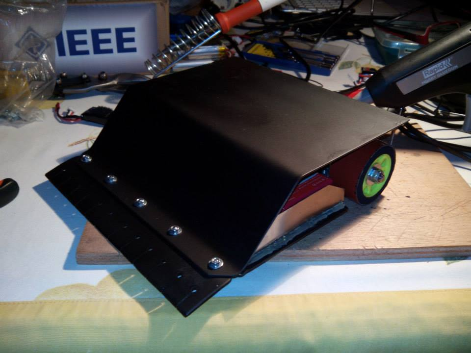
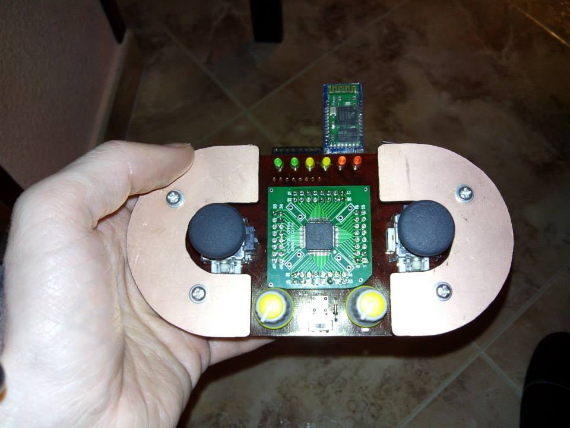

# rc-sumo-kassius
Kassius es un robot de sumo teledirigido que participó en Cybertech en el año 2014.

Su estructura es muy simple, compuesta de una base, una tapa y una cuña, todas de acero. Lleva una Arduino Uno con un shield de motores basado en el VNH2SP30, un bluetooth HC-05 para la comunicación con el mando, dos baterías lipo 2S (una para la electrónica y otra para los motores) y dos servos con dos levas acopladas que levantan el morro del robot para quitar tracción al oponente.

El mando de control es totalmente casero y tiene opciones para controlar la velocidad de cada rueda con un joystick, dos potenciómetros para seleccionar diferentes velocidades máximas, y dos pulsadores frontales (uno para seleccionar la velocidad máxima de entre las dos disponibles; el otro para levantar el morro con las levas).

La documentación del mando se incluye en otro repositorio.

## Autor
[Rubén Espino San José](https://github.com/Resaj)

## License

Todos estos productos están liberados mediante [Creative Commons Attribution-ShareAlike 4.0 International License](http://creativecommons.org/licenses/by-sa/4.0/).  
_All these products are released under [Creative Commons Attribution-ShareAlike 4.0 International License](http://creativecommons.org/licenses/by-sa/4.0/)._
